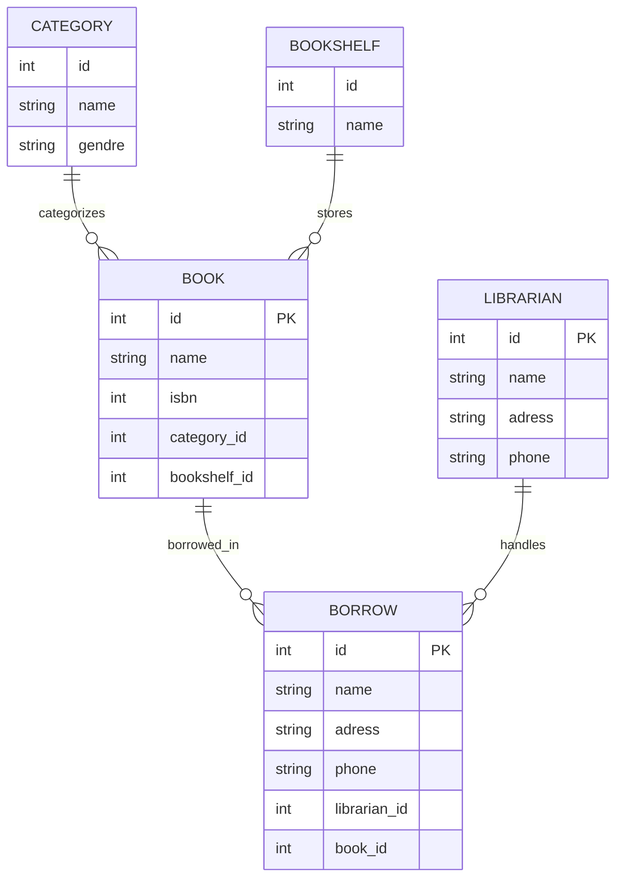

```mermaid
erDiagram
    BOOK {
        int id PK
        string name
        int isbn
        int category_id
        int bookshelf_id
    }
    CATEGORY {
        int id
        string name
        string gendre
    }
    BOOKSHELF {
        int id
        string name
    }
    LIBRARIAN {
        int id PK
        string name
        string adress
        string phone
    }
    BORROW {
        int id PK
        string name
        string adress
        string phone
        int librarian_id
        int book_id
    }

    BOOK ||--o{ BORROW : borrowed_in
    LIBRARIAN ||--o{ BORROW : handles
    CATEGORY ||--o{ BOOK : categorizes
    BOOKSHELF ||--o{ BOOK : stores

```